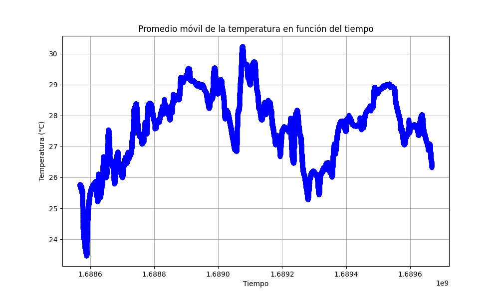

# Entregable 4: Azure + GitLab

#### Francisco Mercado, Jesús Gómez

---

## Pre-requisitos

Para las dos primeras partes del entregable, se hace uso de la herramienta [_SonarQube_](https://www.sonarsource.com/products/sonarqube/), por lo que deberemos preparar un entorno para su ejecución.

En nuestro caso, hemos optado por configurar una máquina virtual en _Azure_ con el sistema operativo _Ubuntu 22.04 LTS_ y provisionarla con las dependencias necesarias.

Para ello, hemos seguido los siguientes pasos:

1.  **Creación de la máquina virtual**
    1. Acceda al portal de _Azure_ y, a continuación, a la sección de [_Virtual Machines_](https://portal.azure.com/#view/HubsExtension/BrowseResource/resourceType/Microsoft.Compute%2FVirtualMachines)
    2. Pulse en _Create_ y, luego, en _Azure Virtual Machine_.
    3. Configure y cree la máquina virtual según sus necesidades.
       - El único item con el que debemos tener cuidado es el tamaño de la máquina virtual a crear, ya que _SonarQube_ necesita de, al menos, 4 GiB para su correcto funcionamiento.
2.  **Configuración de red de la máquina virtual**  
    Debemos establecer una regla de puerto de entrada para poder acceder a la interfaz web de _SonarQube_.
    Para ello:

    1. En el portal de _Azure_, dentro de la sección de máquinas virtuales, seleccione la máquina virtual creada en el paso anterior.
    2. En el menú de la parte izquierda, acceda al apartado de _Network settings_.
    3. Haga click _Create port rule_ y, en el desplegable que aparece, seleccione _Inbound port rule_.
    4. Configure la regla de la siguiente manera:
       - _Source_: Any
       - _Source port ranges_: \*
       - _Destination_: Any
       - _Service_: Custom
       - _Destination port ranges_: 9000
       - _Protocol_: TCP
       - _Action_: Allow
       - _Priority_: 320
       - _Name_: SonarQube

3.  **Provisionamiento de dependencias, instalación y despliegue de _SonarQube_**  
    Una vez creada y configurada la máquina virtual, sobre la que se ejecutará _SonarQube_, debe conectarse a ella para instalar las dependencias necesarias y crear los archivos de configuración necesarios para su correcto funcionamiento.

    1. Vuelva a la sección de _Virtual Machines_ del portal de _Azure_ y seleccione la máquina virtual sobre la que estamos trabajando.
    2. En el menú de la parte izquierda, acceda al apartado de _Connect_.
    3. Seleccione la opción de _SSH using Azure CLI_ y conectese a la máquina virtual.
    4. Una vez conectado, siga los siguientes pasos para instalar las dependencias necesarias y crear los archivos de configuración:

       1. Ejecute el comando: `sudo vi /etc/sysctl.conf` para editar el archivo de configuración del sistema.
       2. Añada las siguientes líneas al final del archivo:

          ```
              vm.max_map_count=262144
              fs.file-max=65536
          ```

          Esto establece el número máximo de archivos que puede tener abiertos el sistema y el número máximo de áreas de memoria compartida.

       3. Ejecute el comando: `sudo sysctl -p` para aplicar los cambios realizados.
       4. Ejecute el comando `sudo hostnamectl set-hostname SonarQube` para cambiar el nombre de la máquina virtual.
       5. Ejecute el comando `sudo apt-get update` para actualizar los repositorios de _apt_.
       6. Ejecute el comando `sudo apt-get upgrade -y` para actualizar los paquetes instalados.
       7. Ejecute el comando `sudo apt install docker-compose -y` para instalar _docker-compose_.
       8. Ejecute el comando `sudo vi docker-compose.yml` para crear el archivo de configuración de _docker-compose_, donde establecerá lo siguiente:

          ```yaml
          version: "3"

          services:
          sonarqube:
            image: sonarqube:community
            restart: unless-stopped
            depends_on:
              - db
            environment:
            SONAR_JDBC_URL: jdbc:postgresql://db:5432/sonar
            SONAR_JDBC_USERNAME: sonar
            SONAR_JDBC_PASSWORD: sonar
            volumes:
              - sonarqube_data:/opt/sonarqube/data
              - sonarqube_extensions:/opt/sonarqube/extensions
              - sonarqube_logs:/opt/sonarqube/logs
            ports:
              - "9000:9000"

          db:
            image: postgres:12
            restart: unless-stopped
            environment:
            POSTGRES_USER: sonar
            POSTGRES_PASSWORD: sonar
            volumes:
              - postgresql:/var/lib/postgresql
              - postgresql_data:/var/lib/postgresql/data

          volumes:
          sonarqube_data:
          sonarqube_extensions:
          sonarqube_logs:
          postgresql:
          postgresql_data:
          ```

          Esto configurará un contenedor de _SonarQube_ y otro de _PostgreSQL_. Este servicio será accesible desde el puerto 9000 de la máquina virtual. Por esta razón, en el paso 2 de la configuración de red de la máquina virtual, se ha establecido una regla de puerto de entrada para dicho puerto.

       9. Ejecute el comando `sudo docker-compose up -d` para iniciar los contenedores.

       **Una vez completados estos pasos, _SonarQube_ estará disponible en la dirección IP pública de la máquina virtual, en el puerto 9000.**

       - Para conocer la dirección IP pública, vuelva a la sección de _Virtual Machines_ del portal de _Azure_, seleccione la máquina virtual sobre la que estamos trabajando y podrá obtener dicha dirección.
       - Para acceder a la interfaz web de _SonarQube_, abra un navegador web y acceda a la dirección IP pública de la máquina virtual, seguida del puerto 9000. Por ejemplo: `http://ip_publica:9000`.

4.  **Creación de un token de autenticación de _Azure DevOps_ para _SonarQube_**

    1. A la izquierda del icono de usuario, haga click en el icono de configuración y, luego, en _Personal access tokens_.
    2. Haga click en _New Token_ y configure los valores del token a generar, según sus necesidades.
       - Asegúrese de seleccionar el alcance de _Full access_.
    3. Copie el token generado y guárdelo en un lugar seguro, ya que no podrá volver a verlo. Esto será necesario, en el siguiente paso, para importar un proyecto de _Azure_ en la inferfaz web de _SonarQube_.

5.  **Importación de un proyecto de _Azure DevOps_ en _SonarQube_**

    1. Acceda a la interfaz web de _SonarQube_ mediante su dirección IP pública, seguida del puerto 9000.
    2. Inicie sesión con las credenciales por defecto:
       - _Username_: admin
       - _Password_: admin
    3. Cambie la contraseña por defecto por una nueva.
    4. En la esquina superior derecha, haga click en _Create Project_ y, a continuación, en _Import from Azure DevOps_.
    5. Configure los valores de la conexión a _Azure DevOps_:
       - _Organization_: Enlace a la organización creada al registrarse en _Azure DevOps_ (_https://dev.azure.com/nombreOrganizacion_).
       - _Project_: Nombre del proyecto de _Azure DevOps_.
       - _Token_: token*de_autenticacion (el generado en el paso 4 desde la interfaz web de \_Azure DevOps*)
    6. Una vez configurada la conexión a _Azure DevOps_, localice el proyecto que desea importar y haga click en _Import_.
    7. Una vez importado el proyecto, en la esquina superior derecha, acceda a _Project Information_ y apunte la _Project Key_ del proyecto importado. Esta será necesaria para configurar el pipeline de _Azure DevOps_.

6.  **Creación de un token de autenticación de _SonarQube_ para _Azure DevOps_**

    1. Acceda a la interfaz web de _SonarQube_.
    2. En la esquina superior derecha, haga click en su nombre de usuario y, luego, en _My account_.
    3. Acceda al apartado de _Security_.
    4. Configure los valores del token a generar, según sus necesidades, y haga click sobre _Generate Tokens_.
    5. Copie el token generado y guárdelo en un lugar seguro, ya que no podrá volver a verlo. Esto será necesario para configurar la conexión de servicio en _Azure DevOps_ en el siguiente paso.

7.  **Creación de una conexión de servicio a _SonarQube_**  
    Para hacer uso de la herramienta que acaba de configurar en cualquier pipeline, es necesario crear una conexión de servicio para que podamos referenciarlas en los pipelines que se desarrolle. Siga estos pasos para crearla:
    1. [Instale la herramienta](https://marketplace.visualstudio.com/items?itemName=SonarSource.sonarqube) en su entorno _Azure DevOps_.
    2. Acceda al proyecto de _Azure DevOps_ que ha creado para el entregable.
    3. En el menú de la parte izquierda, acceda al apartado de _Project settings_.
    4. En el menú de la parte izquierda, acceda al apartado de _Service connections_.
    5. Haga click en _New service connection_ y busque _SonarQube_.
    6. Configure la conexión de la siguiente manera:
       - _Connection name_: SonarQube (este nombre será al que se referencie en los pipelines)
       - _Server URL_: http://ip_publica:9000
       - _Authentication token_: token*de_autenticacion (el generado en el paso 4 desde la interfaz web de \_SonarQube*)

**Al completar estos pasos, ya tendrá configurada la herramienta _SonarQube_ en su entorno _Azure DevOps_ y podrá hacer uso de ella en los pipelines que desarrolle.**

---

## Parte 1: Pipeline de Azure con Dockerfile y Docker-Compose

El objetivo de esta parte es desplegar un entorno de Flask con Redis, haciendo uso de Docker y Docker-Compose, mediante un pipeline de Azure.

Para ello, hemos creado un repositorio en _Azure DevOps_ con el siguiente contenido:

### Dockerfile

```Dockerfile
FROM python:3.7.0-alpine3.8
WORKDIR /usr/src/app
COPY requirements.txt ./
RUN pip install --no-cache-dir -r requirements.txt
COPY . .
ENV FLASK_APP=app.py
CMD flask run --host=0.0.0.0
```

Este archivo de configuración, basada en la imagen de _Python_ para _Alpine Linux_, realiza las siguientes operaciones:

1. Establece el directorio de trabajo en `/usr/src/app`.
2. Copia el archivo `requirements.txt`, cuyo contenido establece las dependencias de la aplicación, al directorio de trabajo.
3. Instala las dependencias del entorno, según lo especificado en el archivo de dependencias.
4. Copia el contenido del directorio actual al directorio de trabajo.
5. Establece la variable de entorno `FLASK_APP` con el valor `app.py`, que es el nombre del archivo que contiene la aplicación _Flask_.
6. Ejecuta el comando `flask run --host=0.0.0.0` para iniciar el servidor de _Flask_.

El archivo de dependencias, `requirements.txt`, al que hace referencia contiene lo siguiente:

```txt
Flask
Redis<3.0.0
```

Esto hace que el instalador de dependencias de _Python_ (_pip_) instale las librerías de _Flask_ y _Redis_, necesarias para el correcto funcionamiento de la aplicación.

### Docker-Compose

El archivo de configuración de _Docker-Compose_, `docker-compose.yml`, se apoya en el archivo de configuración de `Dockerfile` (_explicado en el apartado anterior_) para crear los contenedores necesarios para el despliegue de la aplicación.  
Dicho archivo de configuración especifica lo siguiente:

```yaml
version: "3"
services:
  app:
    build: .
    image: dodero/flask-redis:1.0
    # Imagen base de la aplicación, alojada en Docker Hub
    environment:
      - FLASK_ENV=development
      # Establece el entorno de ejecución de la aplicación
    ports:
      - 80:5000
      # Mapea el puerto 5000 del contenedor al puerto 80 de la máquina host
    networks:
      - mynet
      # Establece la red a la que pertenece el contenedor
  redis:
    image: redis:4.0.11-alpine
    # Imagen base de Redis, alojada en Docker Hub
    networks:
      - mynet
      # Establece la red a la que pertenece el contenedor
networks:
  mynet: # Crea la red a la que pertenecen los contenedores
```

### Pipeline de Azure

Una vez creados los archivos de configuración y configurado el repositorio, hemos creado un pipeline de _Azure DevOps_, con el nombre `azure-pipelines.yml`, para desplegar la aplicación en un entorno de _Azure_.

```yaml
trigger:
  - main

pool:
  vmImage: ubuntu-latest

steps:
  - script: echo Iniciando pipeline...
    displayName: "Inicio del pipeline"

  - task: SonarQubePrepare@5
    displayName: "Conexión con SonarQube"
    inputs:
      SonarQube: "SonarQube"
      scannerMode: "CLI"
      configMode: "manual"
      cliProjectKey: "VS_Entregable_4.1_VS_Entregable_4.1_AYyYM5QkNlNANsh9XTim"
      cliProjectName: "VS Entregable 4.1"
      cliProjectVersion: 1.0
      cliSources: .

  - script: |
      docker-compose up -d
    displayName: "Docker Compose Up"

  - task: SonarQubeAnalyze@5
    displayName: "Análisis de código"
    inputs:
      jdkversion: "JAVA_HOME_11_X64"

  - task: SonarQubePublish@5
    displayName: "Publicación de los resultados"
    inputs:
      pollingTimeoutSec: "300"
```

Este pipeline realiza las siguientes operaciones:

1. Establece la rama `main` como rama de despliegue. Cada vez que se realice un _push_ a dicha rama, se ejecutará el pipeline.
2. Establece la imagen de la máquina virtual de _Azure_ en la que se ejecutará el pipeline. En este caso, se ha seleccionado la imagen `ubuntu-latest`.
3. Establece las tareas que se ejecutarán en el pipeline:
   1. **Conexión con _SonarQube_**:  
      Esta tarea establece la conexión con la herramienta _SonarQube_ para que pueda realizar el análisis de código. Para ello, se referencia la conexión de servicio creada en el paso 7 de la sección de _Pre-requisitos_ y se establece la _Project Key_ del proyecto importado en el paso 5 de la sección de _Pre-requisitos_.
   2. **Ejecución de _Docker-Compose_**:  
      Esta tarea ejecuta el comando `docker-compose up -d` para crear los contenedores necesarios para el despliegue de la aplicación.
   3. **Análisis de código**:  
      Esta tarea ejecuta el comando `sonar-scanner` para realizar el análisis de código y detectar posibles errores y/o vulnerabilidades en los contenedores desplegados.
   4. **Publicación de los resultados**:  
      Esta tarea publica los resultados del análisis en _SonarQube_, visibles desde la interfaz web de la herramienta.

### Resultados

#### Pipeline

Como se puede observar en la siguiente imagen, el pipeline se ha ejecutado correctamente:


#### SonarQube

En la siguiente imagen se puede observar el resultado del análisis de código realizado por _SonarQube_, mediante su interfaz web:


---

## Parte 2: Pipeline de Azure con Terraform

El objetivo de esta parte es desplegar un contenedor de _Nginx_ mediante un pipeline de _Azure_. Para ello, hemos creado un repositorio en _Azure DevOps_ con el siguiente contenido:

### Archivo de configuración Terraform

Este archivo de configuración establecerá los proveedores necesarios para el despliegue de la aplicación y creará los recursos necesarios para el despliegue de la aplicación. En este caso, el proveedor es _Docker_ y el recurso es un contenedor de _Nginx_, cuyo puerto interno 80 mapearemos externamente al puerto 8000.

```terraform
terraform {
  required_providers {
    docker = {
      source  = "kreuzwerker/docker"
      version = "~> 3.0.1"
    }
  }
}

provider "docker" {}

resource "docker_image" "nginx" {
        name = "nginx:latest"
        keep_locally = false
}

resource "docker_container" "nginx" {
    image = docker_image.nginx.image_id
    name = "Entregable4"
    ports {
        internal = 80
        external = 8000
    }
}
```

### Pipeline de Azure

Una vez creados los archivos de configuración y configurado el repositorio, hemos creado un pipeline de _Azure DevOps_, con el nombre `azure-pipelines.yml`, para desplegar la infraestructura, configurada en el archivo de configuración Terraform, en un entorno de _Azure_.

```yaml
trigger:
  - master

pool:
  vmImage: "ubuntu-latest"

steps:
  - task: SonarQubePrepare@5
    displayName: "Conexión con SonarQube"
    inputs:
      SonarQube: "SonarQube"
      scannerMode: "CLI"
      configMode: "manual"
      cliProjectKey: "VS_Entregable_4.1_VS_Entregable_4.2_AYymN3HQ6R_ge7LgpJDR"
      cliProjectName: "VS Entregable 4.2"
      cliProjectVersion: 1.0
      cliSources: .

  - task: UseDotNet@2
    inputs:
      packageType: "sdk"
      version: "3.1.x"
      installationPath: $(Agent.ToolsDirectory)/dotnet

  - script: |
      terraform init
      terraform fmt
      terraform validate
    displayName: "Terraform Init, Format and Validate"

  - script: "terraform plan -out=tfplan"
    displayName: "Terraform Plan"

  - script: "terraform apply -auto-approve tfplan"
    displayName: "Terraform Apply"

  - task: SonarQubeAnalyze@5
    displayName: "Análisis de código"
    inputs:
      jdkversion: "JAVA_HOME_11_X64"

  - task: SonarQubePublish@5
    displayName: "Publicación de los resultados"
    inputs:
      pollingTimeoutSec: "300"
```

Este pipeline realiza las siguientes operaciones:

1. Establece la rama `master` como rama de despliegue. Cada vez que se realice un _push_ a dicha rama, se ejecutará el pipeline.
2. Establece la imagen de la máquina virtual de _Azure_ en la que se ejecutará el pipeline. En este caso, se ha seleccionado la imagen `ubuntu-latest`.
3. Establece las tareas que se ejecutarán en el pipeline:

   1. **Conexión con _SonarQube_**:  
      Esta tarea establece la conexión con la herramienta _SonarQube_ para que pueda realizar el análisis de código. Para ello, se referencia la conexión de servicio creada en el paso 7 de la sección de _Pre-requisitos_ y se establece la _Project Key_ del proyecto importado en el paso 5 de la sección de _Pre-requisitos_.
   2. **Instalación de .NET Core**:  
      Esta tarea instala la versión 3.1.x de _.NET Core_ en la máquina virtual de _Azure_.
   3. **Inicialización, Formateo y Validación de la configuración Terraform**:  
      Esta tarea ejecuta los comandos necesarios para desplegar la infraestructura, configurada en el archivo de configuración Terraform, en un entorno de _Azure_.
      1. Ejecuta el comando `terraform init` para inicializar el directorio de trabajo de _Terraform_.
      2. Ejecuta el comando `terraform fmt` para formatear el archivo de configuración de _Terraform_ a un formato legible y consistente.
      3. Ejecuta el comando `terraform validate` para comprobar si el archivo de configuración de _Terraform_ presenta una estructura sintácticamente válida.
   4. **Planificación de la infraestructura Terraform**:
      Esta tarea ejecuta el comando `terraform plan -out=tfplan` para planificar la creación de la infraestructura (lo cual resulta una buena práctica para comprender qué recursos se crearán o modificarán y cómo afectarán a la infraestructura.).
   5. **Despliegue de la infraestructura Terraform**:
      Esta tarea ejecuta el comando `terraform apply -auto-approve tfplan` para desplegar la infraestructura, según lo especificado en el archivo de configuración.
   6. **Análisis de código**:  
      Esta tarea ejecuta el comando `sonar-scanner` para realizar el análisis de código y detectar posibles errores y/o vulnerabilidades en los contenedores desplegados.
   7. **Publicación de los resultados**:  
      Esta tarea publica los resultados del análisis en _SonarQube_, visibles desde la interfaz web de la herramienta.

### Resultados

#### Pipeline

Como se puede observar en la siguiente imagen, el pipeline se ha ejecutado correctamente:


#### SonarQube

En la siguiente imagen se puede observar el resultado del análisis de código realizado por _SonarQube_, mediante su interfaz web:


---

## Parte 3: Pipeline en GitLab
### PIPELINE GITLAB
El archivo .gitlab-ci.yml es un es un archivo de configuración de un pipeline de CI/CD para gitlab.

Este comienza configurando el entorno antes de ejecutar los scripts del pipeline en la sección before script , donde se instalan las bibliotecas matplotlib y pandas utilizando pip, y se actualiza e instala pandoc utilizando apt-get. A continuación especificaremos la imagen Docker que usaremos, python:3.8.

En la sección variables, se configura la estrategia para manejar los submódulos de Git. En este caso, se utiliza la estrategia recursive.

Luego definimos las etapas del pipeline en la sección stages, en la que encontramos:

* En la etapa clonar, se clona un repositorio de GitLab utilizando un token de acceso. Los archivos clonados se almacenan como artefactos para su uso en etapas posteriores del pipeline.
* En la etapa grafico, se ejecuta un script de Python llamado grafica.py. El resultado de este script, un archivo llamado grafica.png, se almacena como un artefacto.
* En la etapa documentacion, se ejecuta otro script de Python llamado documentacion.py y se convierte un archivo README.md a HTML utilizando pandoc. Los archivos resultantes se almacenan como artefactos.
* En la etapa io, ejecutaremos una serie de comandos para subir los artifacts creados en las etapas anteriores a un repositorio de GitHub, donde se expondra dicha documentacion en GitHub Pages.
### DOCUMENTOS PYTHON
#### grafica.py
Este script se encargará de generar una gráfica (promedio móvil de la temperatura) con los datos que se encuentran en SensorData.csv.

El código comienza importando las bibliotecas necesarias para su funcionamiento. matplotlib.pyplot se utiliza para la visualización de datos, pandas para el manejo de datos y os para interactuar con el sistema operativo.

Se define a continuación la función plot_temperature_vs_time(data), la cual se encargará de crear un DataFrame de Pandas para facilitar el manejo de los datos, calcular el promedio móvil de la temperatura con una ventana de 100 puntos de datos (Cómo cambia la temperatura con el tiemp) y de guardar la gráfica en un archivo denominado grafica.png.

En el bloque principal del programa, se lee SensorData.csv. Los datos de este archivo se pasan a la función plot_temperature_vs_time(data) para generar el gráfico.

Finalmente, el código incluye un manejo de errores básico. Si el archivo SensorData.csv no se encuentra, se imprime un mensaje de error. Cualquier otro error que ocurra durante la ejecución del programa también se imprime. Esto ayuda a diagnosticar y solucionar problemas que puedan surgir durante la ejecución del código.

La gráfica resultante es:



#### documentacion.py
Este script se encargará de generar un documento Markdown llamado README.md, el cual se formará a partir de una lista de archivos presentes en el repositorio, graficos.txt y pipeline.txt.

Para ello lo primero que haremos será importar el el módulo os, que proporciona una forma de interactuar con el sistema operativo. 

Definimos una función denomidad generar_markdown, la cual tomará una lista de archivos como parametro. Esta nicializa una cadena vacía para almacenar el contenido Markdown. Luego, itera sobre la lista de archivos, abriendo cada archivo en modo de lectura. Lee el contenido de cada archivo y lo agrega a la cadena de contenido Markdown. Después de procesar todos los archivos, abre el archivo ‘README.md’ en modo de escritura y escribe el contenido Markdown generado en él.

Además difinimos una funciones main, en la cual se crea la lista de archivos empleada para generar el markdown y llama a la función antes descrita.

En graficos.txt nos encontraremos con información acerca de los dos scripts PYTHON que alberga el entregable, explicando su funcionamiento e incrustando la gráfica resultante, lo cual es un objetivo de esta práctica. Mientras que en pipeline.txt se explicará el contenido del archivo .gitlab-ci.yml.

### Despliegue en GitHub Pages

El despliegue de la documentación se realizará empleando el pipeline de gitlab, con el cual los archivos creados anteriormente y que se encuentran como artifacs se almacenarán en un repositorio de github para exponerlo en Github Pages.

#### Repositorio

GitHub: https://github.com/FranME19/FranME19.github.io
url: https://franme19.github.io/

---

###### Jesús Gómez, Mercado Franciso
